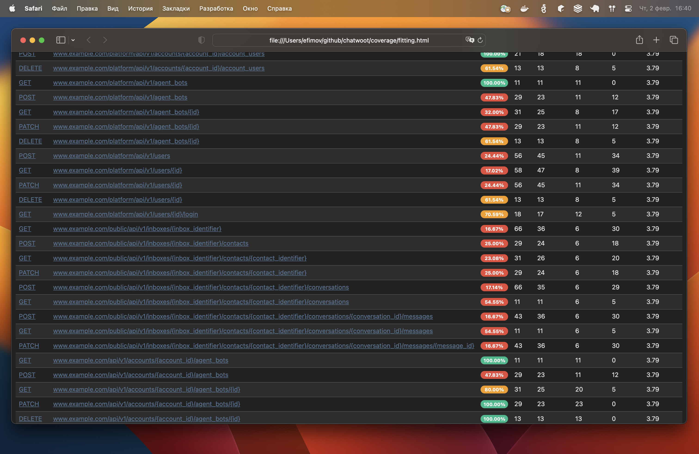
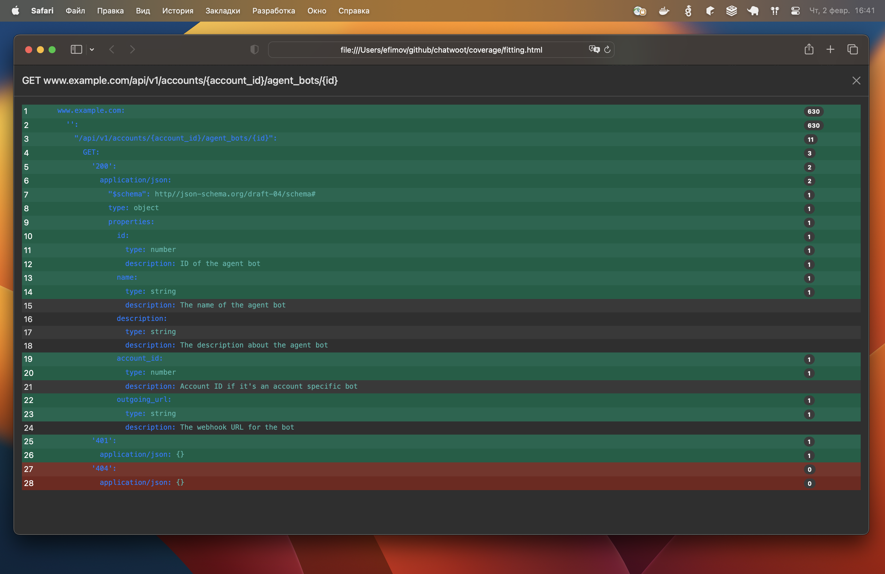
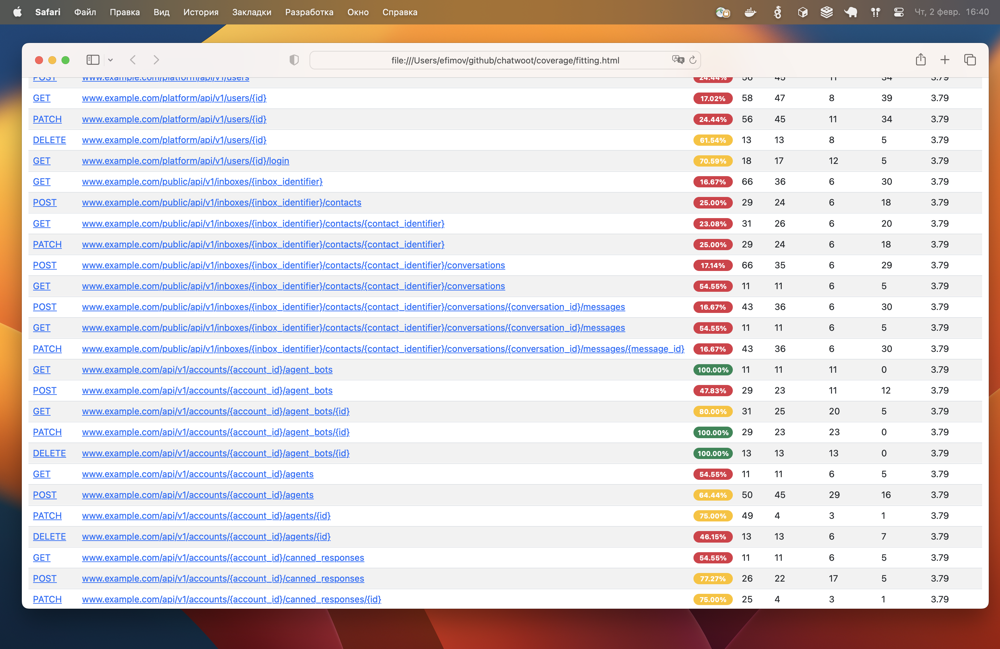
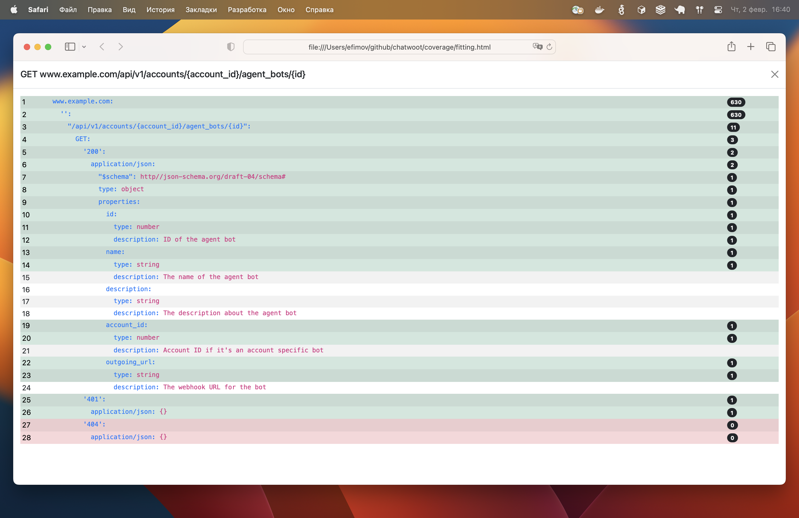

# Fitting


We set up test logs, validate them according to your API documentation and show the documentation coverage with logs.

Test logs setting supports RSpec test (and WebMock stubbing) for Ruby On Rails application and API documentation supports API Blueprint,
Swagger and OpenAPI.

This reduces the costs of support, testers and analysts.

Log
```text
FITTING incoming request {"method":"POST","path":"/public/api/v1/inboxes/tEX5JiZyceiwuKMi1oN9Sf8S/contacts","body":{},"response":{"status":200,"content_type":"application/json","body":{"source_id":"00dbf18d-879e-47cb-ac45-e9aece266eb1","pubsub_token":"ktn6YwPus57JDf4e59eFPom5","id":3291,"name":"shy-surf-401","email":null,"phone_number":null}},"title":"./spec/controllers/public/api/v1/inbox/contacts_controller_spec.rb:9","group":"./spec/controllers/public/api/v1/inbox/contacts_controller_spec.rb","host":"www.example.com"}
FITTING outgoing request {"method":"POST","path":"/v1/organizations/org_id/meeting","body":{},"response":{"status":200,"content_type":"application/json","body":{"success":true,"data":{"meeting":{"id":"meeting_id","roomName":"room_name"}}}},"title":"./spec/controllers/api/v1/accounts/integrations/dyte_controller_spec.rb:50","group":"./spec/controllers/api/v1/accounts/integrations/dyte_controller_spec.rb","host":"api.cluster.dyte.in"}
```

validation
```console
FFFFFFFFFFFFFFFFFFFFFFFFFFFFFFFFFFFFFFFFFFFFFFFF.FFF..FFFFFFFFFF....F.......F...FF.....F...F....F..............................FFFFFFFFFFFFFFFFFFFFFFFFFFFFFFFFFFFFFFFFFFFFFFFFFF..FF.F..FFFFFFFFFFFFFFFFFFFFFFFFFFFFFFFFFFFFFFFFFFFFFFFFFFFFFFFFFFFFFFFFFFFFFFFFFFFFFFFFFFFFFFFFFFFFF..FF........FFF...FFFF......FFFFFFFFFFFFFFFFFFFFFFFFFFFFFFFFFFFFFFFFFFFFFFFFFFFFFFFFFFFFFFFFFFFFFFFFFFFFFFFFFFFFFFFFFFFFFFFFFFFFF........FFFFFFFFFFF..FFFFFF..FFFFFFFFFFFFFFFFF.......FFFFFF.............FFFFFFFFFFFF....F........FFF.F...FFFFFFFFFFFFFFFFFFFFFFFFFFFFFFFFF............FF........FFF......FFFFFFFFFFFFFFFFFFFFFF....FFFFFF......F............FFFF........FFFFFFFFFFFFFF.....FFFFFFFFFFFFFFFFFFFFFFF..FF.....FFFFFFFFFFFFFFFFFFFFFFFFFFFFFFFFFFFFFF.....FF..........FFFFFFFFFFFFFFFFFF...FFFF...............F.F....FF..FFFFFFFF

  1) Fitting::Doc::NotFound log error:

host: www.example.com
method: POST
path: /public/api/v1/inboxes/{inbox_identifier}/contacts
code: 200

content-type: application/json

json-schema: {
  "$schema": "http://json-schema.org/draft-04/schema#",
  "type": "object",
  "properties": {
    "id": {
      "type": "integer",
      "description": "Id of the contact"
    },
    "source_id": {
      "type": "string",
      "description": "The session identifier of the contact"
    },
    "name": {
      "type": "string",
      "description": "Name of the contact"
    },
    "email": {
      "type": "string",
      "description": "Email of the contact"
    },
    "pubsub_token": {
      "type": "string",
      "description": "The token to be used to connect to chatwoot websocket"
    }
  }
}

body: {
  "source_id": "c9e8c31f-06df-49b4-8fb9-4466457ae65b",
  "pubsub_token": "Zgc7DEvaj5TkgZ1a4C7AvJXo",
  "id": 3293,
  "name": "restless-snowflake-670",
  "email": null,
  "phone_number": null
}

error [
  "The property '#/email' of type null did not match the following type: string in schema e56b7e65-d70c-5f7a-a96c-982df5f8f2f7"
]

...

804 examples, 565 failure, 0 pending

Coverage: 65.51%
```

and cover








## Installation
Add this line to your application's Gemfile:
```ruby
gem 'fitting'
```

After that execute:
```bash
$ bundle
```

Or install the gem by yourself:
```bash
$ gem install fitting
```

## Usage
### Log
Firstly, improve `test.log`.

To your `spec_helper.rb`:

```ruby
require 'fitting'

Fitting.logger
```

Delete all files `log/*.log` and run rspec

You get more information about incoming and outgoing request in `log/fitting*.log`.

```text
FITTING incoming request {"method":"POST","path":"/public/api/v1/inboxes/tEX5JiZyceiwuKMi1oN9Sf8S/contacts","body":{},"response":{"status":200,"content_type":"application/json","body":{"source_id":"00dbf18d-879e-47cb-ac45-e9aece266eb1","pubsub_token":"ktn6YwPus57JDf4e59eFPom5","id":3291,"name":"shy-surf-401","email":null,"phone_number":null}},"title":"./spec/controllers/public/api/v1/inbox/contacts_controller_spec.rb:9","group":"./spec/controllers/public/api/v1/inbox/contacts_controller_spec.rb","host":"www.example.com"}
FITTING outgoing request {"method":"POST","path":"/v1/organizations/org_id/meeting","body":{},"response":{"status":200,"content_type":"application/json","body":{"success":true,"data":{"meeting":{"id":"meeting_id","roomName":"room_name"}}}},"title":"./spec/controllers/api/v1/accounts/integrations/dyte_controller_spec.rb:50","group":"./spec/controllers/api/v1/accounts/integrations/dyte_controller_spec.rb","host":"api.cluster.dyte.in"}
```

### Validation
Secondly, validate the logs to the documentation.

Add this to your `.fitting.yml`:

```yaml
APIs:
  - host: www.example.com
    type: openapi2
    path: swagger/swagger.json
```

Run 
```bash
bundle e rake fitting:validate
```

Console output

```console
FFFFFFFFFFFFFFFFFFFFFFFFFFFFFFFFFFFFFFFFFFFFFFFF.FFF..FFFFFFFFFF....F.......F...FF.....F...F....F..............................FFFFFFFFFFFFFFFFFFFFFFFFFFFFFFFFFFFFFFFFFFFFFFFFFF..FF.F..FFFFFFFFFFFFFFFFFFFFFFFFFFFFFFFFFFFFFFFFFFFFFFFFFFFFFFFFFFFFFFFFFFFFFFFFFFFFFFFFFFFFFFFFFFFFF..FF........FFF...FFFF......FFFFFFFFFFFFFFFFFFFFFFFFFFFFFFFFFFFFFFFFFFFFFFFFFFFFFFFFFFFFFFFFFFFFFFFFFFFFFFFFFFFFFFFFFFFFFFFFFFFFF........FFFFFFFFFFF..FFFFFF..FFFFFFFFFFFFFFFFF.......FFFFFF.............FFFFFFFFFFFF....F........FFF.F...FFFFFFFFFFFFFFFFFFFFFFFFFFFFFFFFF............FF........FFF......FFFFFFFFFFFFFFFFFFFFFF....FFFFFF......F............FFFF........FFFFFFFFFFFFFF.....FFFFFFFFFFFFFFFFFFFFFFF..FF.....FFFFFFFFFFFFFFFFFFFFFFFFFFFFFFFFFFFFFF.....FF..........FFFFFFFFFFFFFFFFFF...FFFF...............F.F....FF..FFFFFFFF

  1) Fitting::Doc::NotFound log error:

host: www.example.com
method: POST
path: /public/api/v1/inboxes/{inbox_identifier}/contacts
code: 200

content-type: application/json

json-schema: {
  "$schema": "http://json-schema.org/draft-04/schema#",
  "type": "object",
  "properties": {
    "id": {
      "type": "integer",
      "description": "Id of the contact"
    },
    "source_id": {
      "type": "string",
      "description": "The session identifier of the contact"
    },
    "name": {
      "type": "string",
      "description": "Name of the contact"
    },
    "email": {
      "type": "string",
      "description": "Email of the contact"
    },
    "pubsub_token": {
      "type": "string",
      "description": "The token to be used to connect to chatwoot websocket"
    }
  }
}

body: {
  "source_id": "c9e8c31f-06df-49b4-8fb9-4466457ae65b",
  "pubsub_token": "Zgc7DEvaj5TkgZ1a4C7AvJXo",
  "id": 3293,
  "name": "restless-snowflake-670",
  "email": null,
  "phone_number": null
}

error [
  "The property '#/email' of type null did not match the following type: string in schema e56b7e65-d70c-5f7a-a96c-982df5f8f2f7"
]

...

804 examples, 565 failure, 0 pending

Coverage: 65.51%
```

### Coverage
And task will create HTML (`coverage/fitting.html`) reports.


More information on action coverage


## Settings

### type

#### OpenAPI 2.0
Swagger

```yaml
APIs:
  - host: www.example.com
    type: openapi2
    path: doc/api.json
```

#### OpenAPI 3.0
Also OpenAPI

```yaml
APIs:
  - host: www.example.com
    type: openapi3
    path: doc/api.json
```

#### API Blueprint
First you need to install [drafter](https://github.com/apiaryio/drafter) or [crafter](https://github.com/funbox/crafter).
Works after conversion from API Blueprint to API Elements (in YAML file) with Drafter or Crafter.

That is, I mean that you first need to do this

```bash
drafter doc.apib -o doc.yaml
```

or

```bash
node_modules/.bin/crafter doc.apib > doc.yaml
```

and then

```yaml
APIs:
  - host: www.example.com
    type: drafter
    path: doc/api.yaml
```

or

```yaml
APIs:
  - host: www.example.com
    type: crafter
    path: doc/api.yaml
```

#### Tomograph

To use additional features of the pre-converted [tomograph](https://github.com/funbox/tomograph)

example

```bash
bundle exec tomograph -d crafter --exclude-description doc/api.yml doc/api.json
```

and then

```yaml
APIs:
  - host: www.example.com
    type: tomogram
    path: doc/api.json
```

### prefix

Setting the prefix name is optional. For example, you can do this:

```yaml
APIs:
  - host: www.example.com
    prefix: /api/v3
    type: openapi2
    path: swagger/swagger.json
```

### SkipAPIs

#### host

It is not necessary to immediately describe each host in detail, you can only specify its name and skip it until you are ready to documented it

```yaml
SkipAPIs:
  - host: api.cluster.dyte.in
```

##### prefix

If you want to skip a specific prefix in the host

```yaml
SkipAPIs:
  - host: api.cluster.dyte.in
    prefix: /admin/api
```

## Contributing

Bug reports and pull requests are welcome on GitHub at [github.com/funbox/fitting](https://github.com/funbox/fitting).
This project is intended to be a safe, welcoming space for collaboration, and contributors are expected to adhere to the [Contributor Covenant](http://contributor-covenant.org) code of conduct.

## License

The gem is available as open source under the terms of the [MIT License](http://opensource.org/licenses/MIT).

[](https://funbox.ru)
