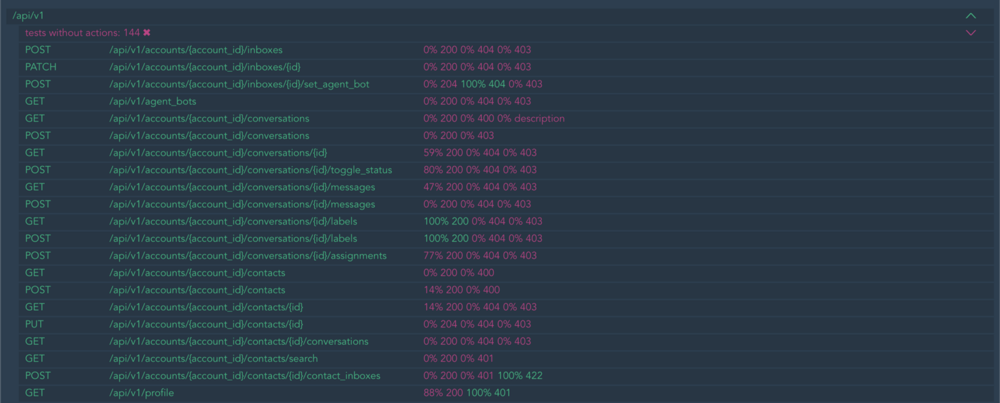
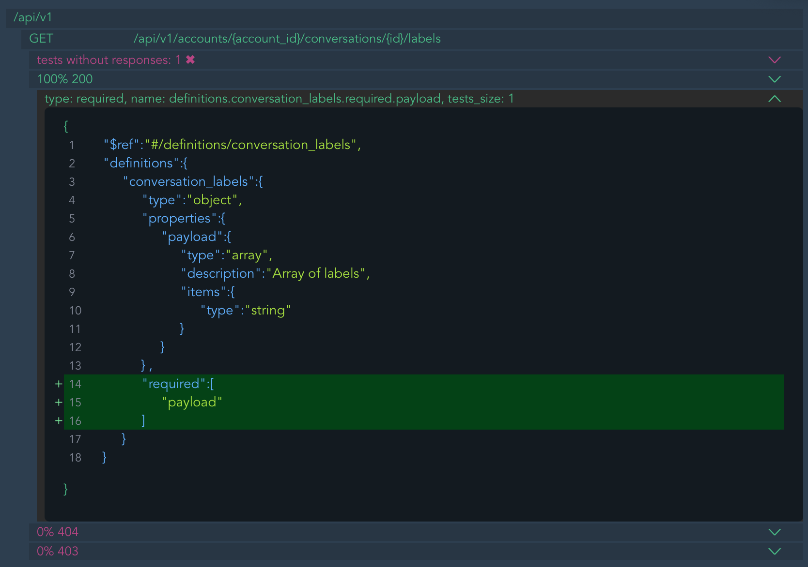

# Fitting
Coverage API Blueprint, Swagger and OpenAPI with rspec tests for easily make high-quality API and documenatiton.


## Installation
Add this line to your application's Gemfile:
```ruby
gem 'fitting'
```

After that execute:
```bash
$ bundle
```

Or install the gem by yourself:
```bash
$ gem install fitting
```

## Usage
And next to your `spec_helper.rb`:

```ruby
require 'fitting'

Fitting.save_test_data
```

Add this to your `.fitting.yml`:

### OpenAPI 2.0
Also Swagger

```yaml
prefixes:
  - name: /api/v1
    openapi2_json_path: doc.json
```

### OpenAPI 3.0
Also OpenAPI

```yaml
prefixes:
  - name: /api/v1
    openapi3_yaml_path: doc.yaml
```

### API Blueprint
First you need to install [drafter](https://github.com/apiaryio/drafter).
Works after conversion from API Blueprint to API Elements (in YAML file) with Drafter.

That is, I mean that you first need to do this

```bash
drafter doc.apib -o doc.yaml
```

and then

```yaml
prefixes:
  - name: /api/v1
    drafter_yaml_path: doc.yaml
```

### Tomograph

To use additional features of the pre-converted [tomograph](https://github.com/funbox/tomograph)

```yaml
prefixes:
  - name: /api/v1
    tomogram_json_path: doc.json
```

## Run
Run tests first to get run artifacts
```bash
bundle e rspec
```

and then
```bash
bundle e rake fitting:report
```

Console ouptut

```text
/api/v1
POST	/api/v1/accounts/{account_id}/inboxes				 0% 200 0% 404 0% 403
PATCH	/api/v1/accounts/{account_id}/inboxes/{id}			 0% 200 0% 404 0% 403
POST	/api/v1/accounts/{account_id}/inboxes/{id}/set_agent_bot	 0% 204 100% 404 0% 403
GET	/api/v1/agent_bots						 0% 200 0% 404 0% 403
GET	/api/v1/accounts/{account_id}/conversations			 0% 200 0% 400 0% description
POST	/api/v1/accounts/{account_id}/conversations			 0% 200 0% 403
GET	/api/v1/accounts/{account_id}/conversations/{id}		 59% 200 0% 404 0% 403
POST	/api/v1/accounts/{account_id}/conversations/{id}/toggle_status	 80% 200 0% 404 0% 403
GET	/api/v1/accounts/{account_id}/conversations/{id}/messages	 47% 200 0% 404 0% 403
POST	/api/v1/accounts/{account_id}/conversations/{id}/messages	 0% 200 0% 404 0% 403
GET	/api/v1/accounts/{account_id}/conversations/{id}/labels		 100% 200 0% 404 0% 403
POST	/api/v1/accounts/{account_id}/conversations/{id}/labels		 100% 200 0% 404 0% 403
POST	/api/v1/accounts/{account_id}/conversations/{id}/assignments	 77% 200 0% 404 0% 403
GET	/api/v1/accounts/{account_id}/contacts				 0% 200 0% 400
POST	/api/v1/accounts/{account_id}/contacts				 14% 200 0% 400
GET	/api/v1/accounts/{account_id}/contacts/{id}			 14% 200 0% 404 0% 403
PUT	/api/v1/accounts/{account_id}/contacts/{id}			 0% 204 0% 404 0% 403
GET	/api/v1/accounts/{account_id}/contacts/{id}/conversations	 0% 200 0% 404 0% 403
GET	/api/v1/accounts/{account_id}/contacts/search			 0% 200 0% 401
POST	/api/v1/accounts/{account_id}/contacts/{id}/contact_inboxes	 0% 200 0% 401 100% 422
GET	/api/v1/profile							 88% 200 100% 401

tests_without_prefixes: 42
tests_without_actions: 144
tests_without_responses: 43
```

And task will create HTML (`fitting/index.html`) reports.


More information on action coverage



## prefix name

Setting the prefix name is optional. For example, you can do this:

```yaml
prefixes:
  - openapi2_json_path: doc.json
```

## Contributing

Bug reports and pull requests are welcome on GitHub at [github.com/funbox/fitting](https://github.com/funbox/fitting).
This project is intended to be a safe, welcoming space for collaboration, and contributors are expected to adhere to the [Contributor Covenant](http://contributor-covenant.org) code of conduct.

## License

The gem is available as open source under the terms of the [MIT License](http://opensource.org/licenses/MIT).

[](https://funbox.ru)
