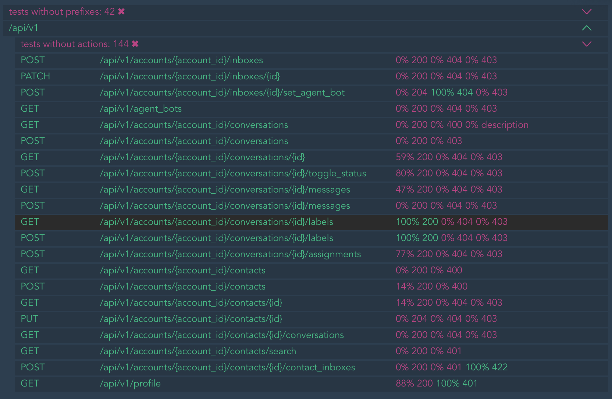

# Fitting


We set up test logs, validate them according to your API documentation and show the documentation coverage with logs.

Test logs setting supports RSpec test for Ruby On Rails application and API documentation supports API Blueprint, 
Swagger and OpenAPI.

This reduces the costs of support, testers and analysts.

Log
```text
2022-02-22T14:20:37.888049+04:00 - 59698 DEBUG - FITTING incoming request {"method":"POST","path":"/api/v1/profile",
"body":{"ids":[]},"response":{"status":200,"body":{"status":"unauthorized"}},
"title":"./spec/support/shared_examples/unauthorized.rb:8","group":"./spec/support/shared_examples/unauthorized.rb"}
2022-02-22T14:20:37.883550+04:00 - 59696 DEBUG - FITTING outgoing request {"method":"POST",
"path":"/sso/oauth2/access_token","body":{},"response":{"status":404,"body":{
"error":"Not found","error_description":"any error_description"}},"title":"./spec/jobs/sso_create_link_job_spec.rb:93",
"group":"./spec/jobs/sso_create_link_job_spec.rb"}
```

validation
```console
..*.....F.

  1) Fitting::Report::Responses::NotFound method: GET, host: books.local, path: /api/v1/users, status: 200,
  body: {"name"=>"test"}


body: {"$schema"=>"http://json-schema.org/draft-04/schema#", "type"=>"enum"}
validate: ["The property '#/' did not contain a required property of 'test' in schema
5115a024-5312-540f-8666-3102097d8c17"]

status: 401

status: 500


10 examples, 1 failure, 1 pending

Coverage 90%
```

and cover


## Installation
Add this line to your application's Gemfile:
```ruby
gem 'fitting'
```

After that execute:
```bash
$ bundle
```

Or install the gem by yourself:
```bash
$ gem install fitting
```

## Usage
### Log
Firstly, improve `test.log`.

To your `spec_helper.rb`:

```ruby
require 'fitting'

Fitting.logger
```

Delete `log/test.log` and run rspec

You get more information about incoming and outgoing request in `log/test.log`.

```text
2022-02-22T14:20:37.888049+04:00 - 59698 DEBUG - FITTING incoming request {"method":"POST","path":"/api/v1/profile",
"body":{"ids":[]},"response":{"status":200,"body":{"status":"unauthorized"}},
"title":"./spec/support/shared_examples/unauthorized.rb:8","group":"./spec/support/shared_examples/unauthorized.rb"}
2022-02-22T14:20:37.883550+04:00 - 59696 DEBUG - FITTING outgoing request {"method":"POST",
"path":"/sso/oauth2/access_token","body":{},"response":{"status":404,"body":{
"error":"Not found","error_description":"any error_description"}},"title":"./spec/jobs/sso_create_link_job_spec.rb:93",
"group":"./spec/jobs/sso_create_link_job_spec.rb"}
```

### Validation
Secondly, validate the logs to the documentation.

Add this to your `.fitting.yml`:

```yaml
```

Run 
```bash
bundle e rake fitting:report
```

Console output

```console
..*.....F.

  1) Fitting::Report::Responses::NotFound method: GET, host: books.local, path: /api/v1/users, status: 200,
  body: {"name"=>"test"}


body: {"$schema"=>"http://json-schema.org/draft-04/schema#", "type"=>"enum"}
validate: ["The property '#/' did not contain a required property of 'test' in schema
5115a024-5312-540f-8666-3102097d8c17"]

status: 401

status: 500


10 examples, 1 failure, 1 pending

Coverage 90%
```

### Coverage
And task will create HTML (`fitting/index.html`) reports.


More information on action coverage


## type

### OpenAPI 2.0
Also Swagger

```yaml
prefixes:
  - name: /api/v1
    type: openapi2
    schema_paths:
      - doc.json
```

### OpenAPI 3.0
Also OpenAPI

```yaml
prefixes:
  - name: /api/v1
    type: openapi3
    schema_paths:
      - doc.yaml
```

### API Blueprint
First you need to install [drafter](https://github.com/apiaryio/drafter).
Works after conversion from API Blueprint to API Elements (in YAML file) with Drafter.

That is, I mean that you first need to do this

```bash
drafter doc.apib -o doc.yaml
```

and then

```yaml
prefixes:
  - name: /api/v1
    type: drafter
    schema_paths:
      - doc.yaml
```

### Tomograph

To use additional features of the pre-converted [tomograph](https://github.com/funbox/tomograph)

```yaml
prefixes:
  - name: /api/v1
    type: tomogram
    schema_paths:
      - doc.json
```

## prefix name

Setting the prefix name is optional. For example, you can do this:

```yaml
prefixes:
  - type: openapi2
    schema_paths:
      - doc.json
```

## prefix skip

It is not necessary to immediately describe each prefix in detail, you can only specify its name and skip it until you are ready to documented it
```yaml
prefixes:
- name: /api/v1
  type: openapi2
  schema_paths:
    - doc.json
- name: /api/v3
  skip: true
```

For work with WebMock outgoing request, you should set up outgoing prefixes
```yaml
outgoing_prefixes:
- name: /api/v1
  type: openapi2
  schema_paths:
    - doc.json
- name: /api/v3
  skip: true
```

You can choose location that must be teste

```yaml
prefixes:
  - type: openapi2
    schema_paths:
      - doc.json
    only:
      - POST /api/v1/users
      - GET /api/v1/user/{id}
```

## Contributing

Bug reports and pull requests are welcome on GitHub at [github.com/funbox/fitting](https://github.com/funbox/fitting).
This project is intended to be a safe, welcoming space for collaboration, and contributors are expected to adhere to the [Contributor Covenant](http://contributor-covenant.org) code of conduct.

## License

The gem is available as open source under the terms of the [MIT License](http://opensource.org/licenses/MIT).

[](https://funbox.ru)
